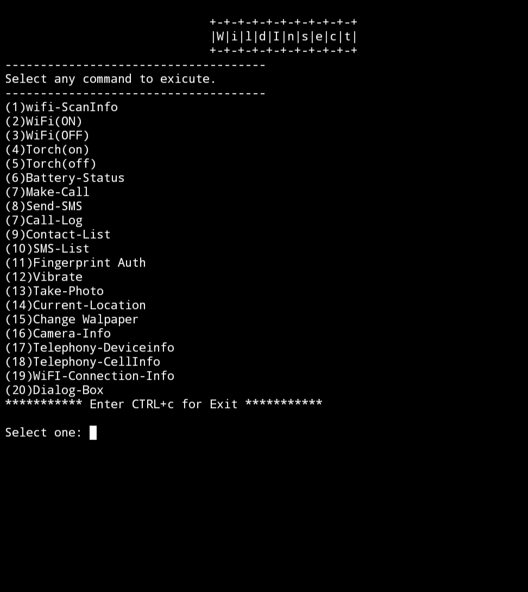

# Termux-Api-Script
#### You can use many of the `Termux Api` commands using this script.
------
## Installetion
**Donload `Termux Api App` from here https://f-droid.org/en/packages/com.termux.api/ and install after installation run the following comments**
```
git clone https://github.com/WildInsect/Termux-Api-Script
chmod +x Api_Script.sh
./Api_Script.sh
```

